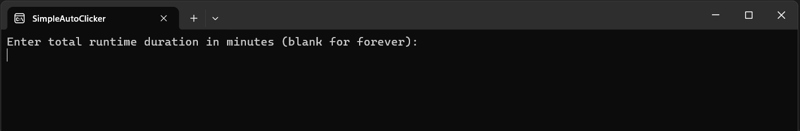
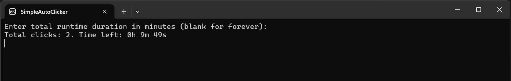

# SimpleAutoClicker

A simple auto clicker built in .NET 8.

Simply input the total time to run in minutes (or leave blank for indefinitaly) and it starts clicking every 10 seconds at mouse position.

## Usage

 1. Download the `.exe` file from the [releases](https://github.com/Marcel0024/SimpleAutoClicker/releases) page and run it.

 2. Input the total minutes and press enter. If you leave it blank, it will run indefinitely. The clicking happens at the mouse's current position.

